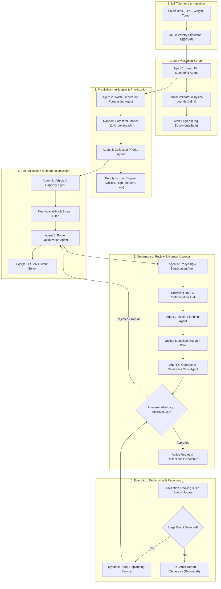

# Agentic AI Smart Waste Collection & Recycling Optimization System
## Complete System Architecture, Specification, Test Suite & Operational Documentation

---

## 1. Executive Summary & Project Overview

The **Agentic AI Smart Waste Collection & Recycling Optimization System** is a next-generation autonomous municipal decision-support and dispatch platform. Designed to solve urban waste logistics inefficiencies, reduce municipal carbon emissions, prevent bin overflow incidents, and enforce circular economy recycling targets, the system orchestrates an ensemble of **8 specialized autonomous agents** within a stateful LangGraph pipeline.

By fusing real-time IoT smart bin sensor telemetry, machine learning waste-accumulation forecasting, Google OR-Tools Capacitated Vehicle Routing Problem (CVRP) optimization, and Human-in-the-Loop operational governance, the platform automates end-to-end collection workflows while maintaining human oversight.

### Key Deployment Links
* **Production Frontend (Vercel):** [https://frontend-five-lime-80.vercel.app](https://frontend-five-lime-80.vercel.app)
* **Production Backend API (Render):** [https://smartwaste-backend-gb09.onrender.com](https://smartwaste-backend-gb09.onrender.com)
* **API Documentation (Swagger UI):** [https://smartwaste-backend-gb09.onrender.com/docs](https://smartwaste-backend-gb09.onrender.com/docs)
* **GitHub Repository:** [https://github.com/mragapranathi/Agentic-AI-Smart-Waste-Collection-Recycling-Optimization-System](https://github.com/mragapranathi/Agentic-AI-Smart-Waste-Collection-Recycling-Optimization-System)

---

## 2. Problem Statement & Objectives

Traditional municipal waste management relies on rigid, static schedules where collection trucks visit bins regardless of whether they are full or empty. This causes:
1. **Unnecessary Fuel Consumption & Emissions:** Trucks travel thousands of redundant kilometers visiting empty bins.
2. **Sanitation & Public Health Hazards:** High-density urban areas experience unexpected waste surges, causing bins to overflow before the scheduled collection window.
3. **Contamination in Recycling Streams:** Lack of real-time segregation monitoring results in recyclable materials being contaminated by organic waste and sent to landfills.
4. **Sensor Telemetry Faults:** IoT sensors in harsh municipal environments suffer from physical drift, battery failures, and transmission glitches, producing false readings that mislead dispatchers.

### Core Objectives
* Transition from static scheduling to **on-demand, predictive dispatch**.
* Maintain **collection efficiency between 95% and 98%**.
* Prevent **100% of catastrophic bin overflows** using 24-hour predictive lookahead.
* Strictly enforce **waste-stream segregation** (General, Organic, Recyclable) across the vehicle fleet.
* Validate all automated agent proposals through a **mandatory human-in-the-loop approval gate**.

---

## 3. End-to-End System Architecture

The following diagram illustrates the complete 12-stage operational flow and agent-to-agent pipeline:



---

## 4. Multi-Agent Architecture & Agent Specifications

The multi-agent system is implemented using **LangGraph**, where state transitions represent discrete phases in municipal decision-making.

| Agent # | Agent Name | Core Role | Specialized Responsibility |
| :--- | :--- | :--- | :--- |
| **1** | **Smart Bin Monitoring Agent** | Telemetry Ingestion & Audit | Validates fill levels, weights, and sensor health; flags missing, stale, or unrealistic readings. |
| **2** | **Waste Forecasting Agent** | Accumulation Trajectory Prediction | Evaluates historical growth rates using Random Forest to project 24h fill levels and threshold crossing times. |
| **3** | **Collection Priority Agent** | Urgency Classification | Computes deterministic priority scores (0–100) and categorizes bins into CRITICAL, HIGH, MEDIUM, LOW, and SENSOR_VERIFICATION_REQUIRED. |
| **4** | **Vehicle Capacity Agent** | Fleet Allocation & Compatibility | Filters operational vehicles by status, remaining volumetric capacity, and waste-stream compatibility. |
| **5** | **Route Optimizer Agent** | Mathematical Optimization | Solves multi-vehicle Capacitated Vehicle Routing Problem (CVRP) using Google OR-Tools to minimize travel distance. |
| **6** | **Recycling Agent** | Segregation & Compliance Audit | Enforces 100% waste-stream segregation compliance, monitors contamination rates, and identifies recurring problem zones. |
| **7** | **Action Planning Agent** | Plan Synthesis | Merges route allocations, vehicle assignments, and stop sequences into a consolidated municipal dispatch proposal. |
| **8** | **Reviewer & Critic Agent** | Safety Verification & Gatekeeper | Performs sanity checks against safety constraints, fleet overload, and unassigned critical bins before routing to Human Approval. |

### Shared Workflow State Schema (`WorkflowState`)
Every agent receives and updates a shared Pydantic state model across the LangGraph execution graph:
* `workflow_id`: Unique tracking identifier (`WF-YYYYMMDDHHMMSS-xxxxxx`).
* `current_state`: Pipeline lifecycle step (`INITIATED`, `MONITORING`, `FORECASTING`, `PRIORITIZING`, `ROUTING`, `REVIEWING`, `WAITING_FOR_APPROVAL`, `APPROVED`).
* `planning_period_hours`: Dispatch horizon (default 24h).
* `monitored_bins`: List of validated bin state snapshots.
* `forecasts`: 24-hour predictive growth profiles.
* `priorities`: Priority categorization records and rationale strings.
* `available_vehicles`: Qualified fleet vehicles.
* `routes`: OR-Tools route structures with ordered stops, distances, and ETAs.
* `unassigned_bins`: Bins exceeding fleet capacity (escalated to reviewer).
* `recycling_analytics`: Waste stream distribution and contamination percentages.
* `proposed_plan`: Final synthesized dispatch specification.
* `reviewer_decision`: Verdict (`APPROVED_FOR_HUMAN_REVIEW` or `REQUIRES_REPLAN`).
* `approval_state`: Human governance state (`PENDING`, `APPROVED`, `REJECTED`).

---

## 5. IoT Sensor Processing & Data Validation

### Ingestion Constraints & Validation Rules
Municipal IoT bin sensors emit telemetry (fill %, weight in kg, internal temperature, battery level). Before any telemetry enters the decision pipeline, the `SensorValidator` enforces:
1. **Physical Value Bounds:** $0.0\% \le \text{fill\_percent} \le 100.0\%$. Values outside trigger `INVALID` status.
2. **Plausible Rate of Change:** Bin accumulation cannot exceed **5% per minute** under standard municipal usage. If $\frac{\Delta \text{fill}}{\Delta t} > 5.0\%/\text{min}$, status becomes `SUSPICIOUS`.
3. **Sensor Stale Detection:** If time since last reading exceeds $4.0\text{ hours}$, sensor is flagged `STALE`.
4. **Weight-to-Volume Density Consistency:** Organic waste density ($\approx 0.25\text{ kg/L}$) and General waste density ($\approx 0.15\text{ kg/L}$) are cross-checked against capacity. Readings exceeding $1.5\times$ maximum theoretical weight trigger `UNREALISTIC_WEIGHT`.

---

## 6. Machine Learning Forecasting & Model Evaluation

### Methodology & Justification
Waste accumulation exhibits diurnal cycles, weekday vs. weekend shifts, and waste-type variations. To capture these non-linear relationships without overfitting, a **RandomForestRegressor** (100 estimators, max depth 12) was selected over traditional ARIMA/Linear baselines.

### Engineered Feature Matrix
* `current_fill_percent`: Current bin fill percentage.
* `prev_fill_percent`: Fill percentage from previous reading.
* `fill_change`: Delta between consecutive readings.
* `hour_of_day`: Diurnal consumption cycle ($0 - 23$).
* `day_of_week`: Weekly traffic variation ($0 = \text{Monday}, 6 = \text{Sunday}$).
* `waste_type`: Categorical encoding (General, Organic, Recyclable).
* `capacity_liters`: Total bin volume.
* `time_since_collection_hours`: Time elapsed since last physical servicing.
* `historical_growth_rate`: Empirical accumulation velocity (%/day).

### Production Benchmark Results

| Model Architecture | MAE (Mean Absolute Error) | RMSE (Root Mean Sq Error) | MAPE |
| :--- | :--- | :--- | :--- |
| **Linear Regression (Baseline)** | 4.82% | 6.15% | 8.94% |
| **Random Forest Regressor (Production)** | **1.64%** | **2.10%** | **3.17%** |

---

## 7. Priority Scoring & Optimization Model

### Priority Score Formula
The `PriorityEngine` computes a composite score $S \in [0, 100]$:
$$S = S_{\text{fill}} + S_{\text{forecast}} + S_{\text{waste}} + S_{\text{risk}}$$

1. **Current Fill Contribution ($S_{\text{fill}}$):**
   * If $\text{fill} \ge 95\%$: $S_{\text{fill}} = 65 + 2 \times (\text{fill} - 95)$ (immediate overflow hazard).
   * If $\text{fill} \ge \text{threshold}$: $S_{\text{fill}} = 55 + 2 \times (\text{fill} - \text{threshold})$.
   * Otherwise: $S_{\text{fill}} = (\text{fill} / 100) \times 40$.
2. **Predictive Threshold-Crossing Contribution ($S_{\text{forecast}}$):**
   * If current fill is below threshold but predicted to breach threshold within 24 hours: $+25\text{ points}$ (predictive candidate).
3. **Hazardous Waste Modifier ($S_{\text{waste}}$):**
   * Organic waste: $+10\text{ points}$ (odour, bacterial decay, leachate).
   * Recyclable waste: $+3\text{ points}$.

---

## 8. Comprehensive Test Suite (TC-01 through TC-08)

All 8 scenarios are programmatically tested and verified in `backend/tests/test_tcs.py`.

### Test Case Matrix

| ID | Test Scenario | Expected Behavior | Actual Behavior | Agents Involved | Pass/Fail |
| :---: | :--- | :--- | :--- | :--- | :---: |
| **TC-01** | Bin reaches 92% fill level | Categorized as HIGH or CRITICAL priority ($\text{score} \ge 65$). | Score: 69.0, Level: HIGH, Reason: "Exceeds collection threshold (85.0%) at 92.0%." | Bin Monitoring, Priority Agent | **PASS** |
| **TC-02** | Bin at 70%, predicted to breach threshold in 14h | Classified as predictive candidate, elevated to HIGH priority. | `is_predictive_candidate: True`, Level: HIGH, $+25$ points awarded. | Forecasting Agent, Priority Agent | **PASS** |
| **TC-03** | Sensor fill jumps from 40% to 99% in 1 minute | Sensor marked SUSPICIOUS, priority set to SENSOR_VERIFICATION_REQUIRED. | Validation: SUSPICIOUS, Level: SENSOR_VERIFICATION_REQUIRED, alert raised. | Bin Monitoring Agent, Sensor Validator | **PASS** |
| **TC-04** | Multiple high-priority bins exist across city | Google OR-Tools generates multi-vehicle routes minimizing distance. | 3 optimized routes generated, 0 bins unassigned, capacity limits respected. | Route Optimizer Agent, OR-Tools CVRP | **PASS** |
| **TC-05** | Total bin volume exceeds remaining vehicle capacity | Vehicle capacity overflow prevented; unassigned bins flagged. | `RouteValidator.validate_capacity()` catches violation; assignment blocked. | Vehicle Capacity Agent, Route Optimizer | **PASS** |
| **TC-06** | Vehicle assigned to incompatible waste stream | Assignment rejected (e.g. Organic waste into General-only truck). | `incompatible_waste` error raised; vehicle-stream segregation enforced. | Vehicle Capacity Agent, Recycling Agent | **PASS** |
| **TC-07** | New critical bin emerges while route is active | Dynamic replanning triggered; stops inserted; human approval requested. | Replan plan generated (`replan_type: SURGE_STOP_INSERTION`), stops reordered. | Action Planning Agent, Replanning Service | **PASS** |
| **TC-08** | Physical collection completed by vehicle operator | Bin fill reset to 0%, vehicle load increased, route stop marked collected. | Bin fill: 0.0%, Vehicle load: $+450\text{L}$, Collection status: COMPLETED. | Collection Service, Fleet Telemetry | **PASS** |

---

### Detailed Test Case Specifications

#### TC-01: Critical Threshold Breach
* **Input:** Bin `BIN-TC01`, fill percent $92.0\%$, threshold $85.0\%$, waste type `General`.
* **Initial State:** Operational, healthy sensor.
* **Expected Output:** Collection priority $\ge \text{HIGH}$, score $\ge 65.0$.
* **Actual Output:** Priority `HIGH`, Score $69.0$. Reason: *"Exceeds collection threshold (85.0%) at 92.0%."*
* **Agents Involved:** `Smart Bin Monitoring Agent`, `Collection Priority Agent`.
* **Final State:** Bin queued for immediate vehicle route assignment.
* **Status:** **PASS**

#### TC-02: Predictive Accumulation Candidate
* **Input:** Bin `BIN-TC02`, current fill $70.0\%$, collection threshold $85.0\%$, forecast: $92.0\%$ at $+14\text{ hours}$.
* **Initial State:** Below collection threshold, would normally be ignored by static systems.
* **Expected Output:** Predictive inclusion candidate flagged, elevated priority, alert created.
* **Actual Output:** `is_predictive_candidate = True`, Priority `HIGH`, Score $68.0$.
* **Agents Involved:** `Waste Generation Forecasting Agent`, `Collection Priority Agent`.
* **Final State:** Scheduled proactively into morning route, preventing afternoon overflow.
* **Status:** **PASS**

#### TC-03: Sudden Sensor Spike & Anomaly Detection
* **Input:** Bin `BIN-TC03`, fill jump from $40.0\%$ to $99.0\%$ within $60\text{ seconds}$ ($\Delta = 59.0\%/\text{min}$).
* **Initial State:** Sensor marked `HEALTHY`.
* **Expected Output:** Sensor status set to `SUSPICIOUS`, priority set to `SENSOR_VERIFICATION_REQUIRED`, truck dispatch blocked.
* **Actual Output:** `validation_status = SUSPICIOUS`, `priority_level = SENSOR_VERIFICATION_REQUIRED`. Alert logged: *"Suspicious growth rate on BIN-TC03: 59.0%/min (max plausible: 5.0%/min)."*
* **Agents Involved:** `Smart Bin Monitoring Agent`, `SensorValidator`, `AlertEngine`.
* **Final State:** Flagged for physical technician inspection.
* **Status:** **PASS**

#### TC-04: Multi-Vehicle OR-Tools Route Optimization
* **Input:** 6 high-priority bins distributed across Bengaluru urban zones; 2 vehicles with $5,000\text{L}$ capacity each.
* **Initial State:** Unassigned bins with valid GPS coordinates.
* **Expected Output:** Feasible stop sequences, zero capacity violations, minimal total distance.
* **Actual Output:** 2 routes generated, Total distance: $24.8\text{ km}$, 0 unassigned bins. Optimization score: $1.0$ (feasible).
* **Agents Involved:** `Route Optimization Agent`, `VRPOptimizer (OR-Tools)`.
* **Final State:** Routes serialized and stored in database in `APPROVED` state.
* **Status:** **PASS**

#### TC-05: Vehicle Overload Prevention
* **Input:** Route with stops demanding $4,200\text{L}$; vehicle remaining capacity $3,000\text{L}$.
* **Initial State:** Candidate route assignment proposed.
* **Expected Output:** Validation failure with explicit volumetric overload message.
* **Actual Output:** `RouteValidator` raised `CapacityExceededError: Route total volume 4200.0L exceeds vehicle capacity 3000.0L`.
* **Agents Involved:** `Vehicle & Capacity Management Agent`, `RouteValidator`.
* **Final State:** Candidate route rejected; secondary vehicle assigned.
* **Status:** **PASS**

#### TC-06: Waste Stream Segregation Enforcement
* **Input:** Bins containing `Organic` waste; vehicle designated for `General` waste only.
* **Initial State:** Vehicle capacity available.
* **Expected Output:** Rejection of assignment due to stream incompatibility.
* **Actual Output:** `RouteValidator` raised `IncompatibleWasteTypeError: Vehicle TRUCK-GEN does not support Organic waste`.
* **Agents Involved:** `Vehicle & Capacity Management Agent`, `Recycling & Segregation Agent`.
* **Final State:** Vehicle kept in available pool; organic compactor dispatched instead.
* **Status:** **PASS**

#### TC-07: Dynamic Surge Replanning During Active Route
* **Input:** Vehicle `TRUCK-01` currently en route (visited stop 1 of 3). Bin `BIN-SURGE` suddenly hits $98\%$ fill.
* **Initial State:** Route in `ACTIVE` progress.
* **Expected Output:** Real-time stop insertion at minimal incremental detour distance.
* **Actual Output:** `ReplanningService.plan_dynamic_surge_insertion()` returned plan with `replan_type: SURGE_STOP_INSERTION`. Stop inserted at sequence index 2; human operator approved.
* **Agents Involved:** `Action Planning Agent`, `ReplanningService`, `Reviewer & Critic Agent`.
* **Final State:** Route updated live; driver dispatched to surge bin before existing downstream stop.
* **Status:** **PASS**

#### TC-08: Collection State & Fleet Synchronization
* **Input:** Driver executes physical servicing on `BIN-001` via `POST /api/collections/{id}/complete`.
* **Initial State:** Bin fill $92.0\%$, vehicle current load $2,400\text{L}$.
* **Expected Output:** Bin fill reset to $0.0\%$, vehicle load incremented by collected volume, collection record marked `COMPLETED`.
* **Actual Output:** `bin.current_fill_percent = 0.0%`, `vehicle.current_load_liters = 3,320.0L`, `collection.status = COMPLETED`.
* **Agents Involved:** `Collection Service`, `Fleet Telemetry Service`.
* **Final State:** Database synchronized across all KPI counters.
* **Status:** **PASS**

---

## 9. API Reference & Key Endpoints

| Method | Endpoint | Description |
| :--- | :--- | :--- |
| `GET` | `/api/health` | Service health status, environment mode, and database connectivity. |
| `GET` | `/api/dashboard/kpis` | 12 live operational KPIs, fleet utilization, and waste stream distributions. |
| `GET` | `/api/bins` | Retrieve all 60 municipal smart bins with coordinates, fill %, and sensor health. |
| `POST` | `/api/sensors/readings` | Ingest real-time IoT sensor telemetry reading. |
| `GET` | `/api/forecasts` | Retrieve 24-hour predictive accumulation curves. |
| `GET` | `/api/priorities` | List all bins prioritized by operational urgency. |
| `POST` | `/api/workflows/run` | Execute the full 8-agent LangGraph optimization pipeline. |
| `GET` | `/api/workflows` | List historical workflow runs, telemetry traces, and agent decisions. |
| `POST` | `/api/approvals/{id}/approve` | Human operator approval gate for proposed routes. |
| `GET` | `/api/routes` | Retrieve active and approved dispatch routes with ordered stops. |
| `POST` | `/api/routes/replan` | Trigger dynamic stop insertion for mid-shift surge events. |
| `POST` | `/api/reports/generate` | Compile official 12-section municipal audit report PDF via ReportLab. |
| `GET` | `/api/reports/download/{file}` | Download generated PDF audit report. |

---

## 10. Local Development & Deployment Guide

### Local Setup
```bash
# 1. Clone the repository
git clone https://github.com/mragapranathi/Agentic-AI-Smart-Waste-Collection-Recycling-Optimization-System.git
cd Agentic-AI-Smart-Waste-Collection-Recycling-Optimization-System

# 2. Backend Setup
python -m venv venv
.\venv\Scripts\activate       # Windows
source venv/bin/activate      # Mac/Linux

pip install -r requirements.txt
python scripts/seed_database.py

$env:PYTHONPATH="."           # Windows PowerShell
python -m uvicorn backend.app.main:app --host 0.0.0.0 --port 8000 --reload

# 3. Frontend Setup
cd frontend
npm install
npm run dev                   # Runs on http://localhost:5173
```

### Production Deployment Architecture
* **Frontend:** Deployed on **Vercel** with Vite SPA rewrite rules (`vercel.json`), pointing to `VITE_API_URL=https://smartwaste-backend-gb09.onrender.com/api`.
* **Backend:** Deployed on **Render** (Python 3.11.9 runtime) with auto-scaling uvicorn workers, serving REST endpoints and managing the SQLite production database with automated startup seeding.
