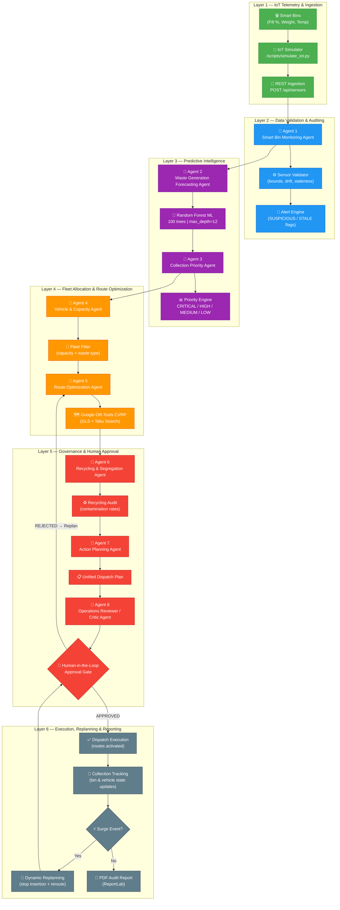
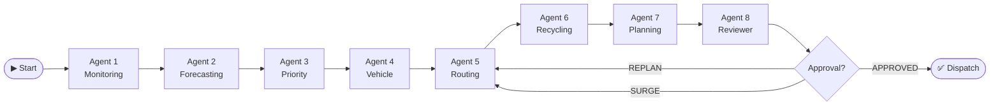
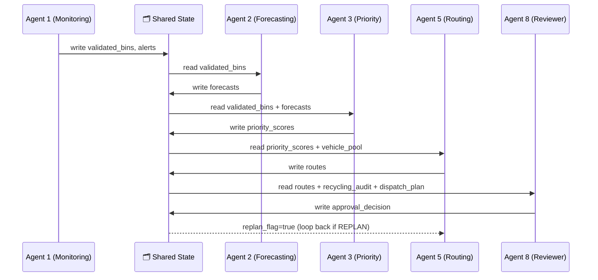
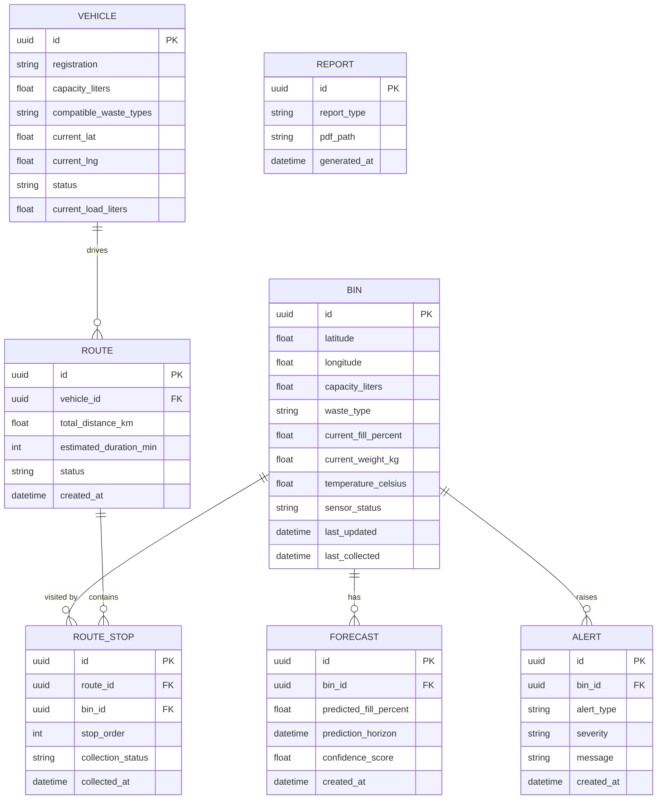
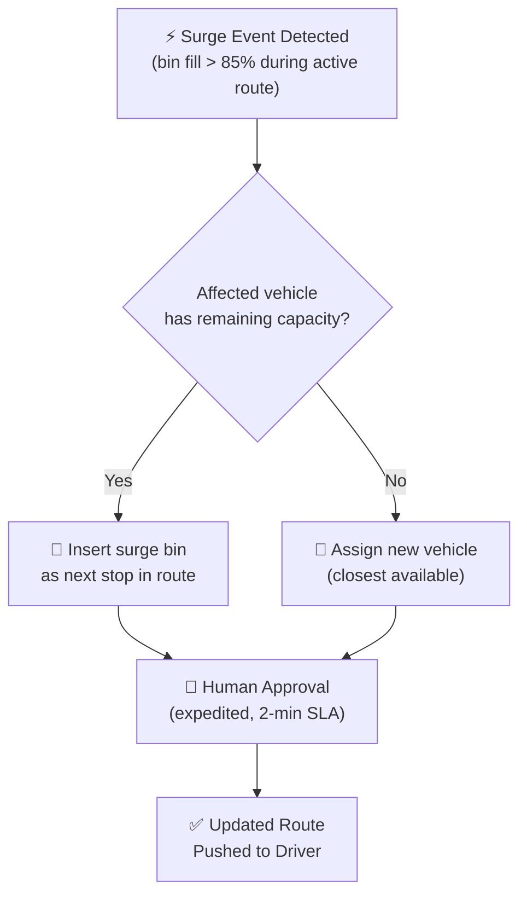

# 🗑️ Agentic AI Smart Waste Collection & Recycling Optimization System

[](https://fastapi.tiangolo.com)
[](https://langchain-ai.github.io/langgraph/)
[](https://developers.google.com/optimization)
[](https://react.dev)
[](https://www.typescriptlang.org)
[](https://scikit-learn.org)
[](LICENSE)
[](backend/tests/test_tcs.py)

---

## 🌐 Live Application

| Component | Platform | URL |
|:---|:---|:---|
| **Frontend** | Vercel | [https://frontend-five-lime-80.vercel.app](https://frontend-five-lime-80.vercel.app) |
| **Backend REST API** | Render | [https://smartwaste-backend-gb09.onrender.com](https://smartwaste-backend-gb09.onrender.com) |
| **Interactive API Docs (Swagger)** | Render | [https://smartwaste-backend-gb09.onrender.com/docs](https://smartwaste-backend-gb09.onrender.com/docs) |
| **GitHub Repository** | GitHub | [mragapranathi/Agentic-AI-Smart-Waste-Collection-Recycling-Optimization-System](https://github.com/mragapranathi/Agentic-AI-Smart-Waste-Collection-Recycling-Optimization-System) |

---

## 📋 Table of Contents

1. [Project Overview](#1-project-overview)
2. [Problem Statement](#2-problem-statement)
3. [System Architecture](#3-system-architecture)
4. [Multi-Agent Architecture](#4-multi-agent-architecture)
5. [Agent Roles](#5-agent-roles)
6. [Agent Prompts](#6-agent-prompts)
7. [Agent-to-Agent Communication](#7-agent-to-agent-communication)
8. [Shared Workflow State](#8-shared-workflow-state)
9. [Smart-Bin Data Model](#9-smart-bin-data-model)
10. [IoT Simulation](#10-iot-simulation)
11. [Sensor-Data Ingestion](#11-sensor-data-ingestion)
12. [Sensor Validation](#12-sensor-validation)
13. [Forecasting Dataset](#13-forecasting-dataset)
14. [Feature Engineering](#14-feature-engineering)
15. [Forecasting Model](#15-forecasting-model)
16. [Model Evaluation](#16-model-evaluation)
17. [Collection-Priority Methodology](#17-collection-priority-methodology)
18. [Vehicle-Management Logic](#18-vehicle-management-logic)
19. [Route-Optimization Problem Formulation](#19-route-optimization-problem-formulation)
20. [Optimization Algorithm](#20-optimization-algorithm)
21. [Dynamic Replanning](#21-dynamic-replanning)
22. [GIS Implementation](#22-gis-implementation)
23. [Waste-Segregation Rules](#23-waste-segregation-rules)
24. [Recycling Calculations](#24-recycling-calculations)
25. [Human-Approval Mechanism](#25-human-approval-mechanism)
26. [Database Design](#26-database-design)
27. [API Documentation](#27-api-documentation)
28. [Environment Variables](#28-environment-variables)
29. [Backend Setup](#29-backend-setup)
30. [Frontend Setup](#30-frontend-setup)
31. [Local Execution](#31-local-execution)
32. [Deployment](#32-deployment)
33. [Testing Methodology](#33-testing-methodology)
34. [Submission Requirements](#34-submission-requirements)

---

## 1. Project Overview

The **Agentic AI Smart Waste Collection & Recycling Optimization System** is a fully autonomous municipal decision-support platform. It orchestrates **8 specialized AI agents** inside a stateful LangGraph pipeline to:

- Ingest real-time smart-bin sensor telemetry (fill level, weight, temperature)
- Validate sensor readings for physical consistency and drift
- Forecast 24-hour fill-level trajectories using machine learning
- Prioritize bin collections using a deterministic scoring engine
- Allocate vehicles based on capacity and waste-type compatibility
- Solve the Capacitated Vehicle Routing Problem (CVRP) using Google OR-Tools
- Enforce recycling and waste-segregation compliance
- Present a unified dispatch plan for human approval
- Dynamically replan routes when surge events occur mid-collection
- Generate PDF audit reports for regulatory compliance

The system is built on **FastAPI** (backend), **React + TypeScript** (frontend), **SQLAlchemy + PostgreSQL** (persistence), and **LangGraph** (agent orchestration).

---

## 2. Problem Statement

Municipal waste management authorities face a growing set of operational challenges:

| Challenge | Impact |
|:---|:---|
| **Overflow bins** | Public health risk, regulatory penalties |
| **Inefficient routing** | Excessive fuel consumption, CO₂ emissions |
| **Static collection schedules** | Miss sudden demand spikes |
| **Poor recycling compliance** | Cross-contamination, lower recycling rates |
| **Manual dispatch planning** | Slow, error-prone, difficult to audit |
| **No predictive maintenance** | Sensor failures go undetected |

**Our solution** replaces manual scheduling and reactive collection with a fully automated, prediction-driven, and human-governed workflow that reduces collection costs, improves recycling rates, and ensures timely service across an entire municipality.

---

## 3. System Architecture

The platform is organized in **6 processing layers**, each handled by dedicated agents:



### End-to-End Data Flow Summary

```
Sensor Reading → Data Validation → Fill-Level Monitoring → Waste Forecasting
→ Collection Priority → Vehicle Availability → Route Optimization
→ Human Approval → Collection Tracking → Dynamic Replanning
→ Recycling Analysis → Final Operational Report
```

---

## 4. Multi-Agent Architecture

The system uses **LangGraph** as the agent orchestration framework. Each agent is a **LangGraph node** that receives a typed state dict, performs its computation, and returns an updated state. Nodes are connected by directed edges, with conditional branching for replanning and approval loops.



All 8 agents share a **single workflow state** — a Python dataclass / Pydantic model. There are no message queues between agents; state is passed directly through LangGraph's in-memory graph context, guaranteeing atomic, reproducible runs.

---

## 5. Agent Roles

| # | Agent | File | Responsibility |
|:---:|:---|:---|:---|
| 1 | **Smart Bin Monitoring Agent** | `backend/app/services/bin_monitoring.py` | Ingest telemetry, validate sensors, raise alerts, maintain bin health status |
| 2 | **Waste Generation Forecasting Agent** | `backend/app/services/forecasting.py` | Load trained RF model, compute 24-h fill predictions for each active bin |
| 3 | **Collection Priority Agent** | `backend/app/services/priority_engine.py` | Compute deterministic priority scores (0–100), assign CRITICAL/HIGH/MEDIUM/LOW tiers |
| 4 | **Vehicle & Capacity Agent** | `backend/app/services/vehicle_service.py` | Query fleet availability, filter by remaining capacity and waste-stream compatibility |
| 5 | **Route Optimization Agent** | `backend/app/services/route_optimizer.py` | Build distance matrix, invoke OR-Tools CVRP solver, return ordered stop sequences |
| 6 | **Recycling & Segregation Agent** | `backend/app/services/recycling_agent.py` | Audit waste-stream assignments, compute recycling rates, flag contamination hotspots |
| 7 | **Waste Operations & Action Planning Agent** | `backend/app/services/dispatch_planner.py` | Synthesize routes + driver shifts + ETAs into a formal municipal dispatch blueprint |
| 8 | **Operations Reviewer / Critic Agent** | `backend/app/services/reviewer_critic.py` | Independent feasibility audit, safety margin checks, gating for human-approval queue |

---

## 6. Agent Prompts

Each agent receives a structured **system prompt** and a **user prompt** constructed from the current workflow state. Prompts are stored in `backend/app/prompts/`.

### Example — Agent 3 (Collection Priority Agent)

**System Prompt:**
```
You are a municipal waste-collection priority analyst. Your job is to evaluate
each smart bin's current fill level, its 24-hour forecast, and its waste hazard
classification, and return a deterministic priority score between 0 and 100.
Rules:
  - Fill ≥ 85 %   → add 50 points (CRITICAL threshold)
  - Fill ≥ 65 %   → add 30 points (HIGH threshold)
  - Predictive overflow within 24 h → add 25 points
  - Hazardous waste type → multiply score × 1.3
  - Sensor marked SUSPICIOUS → override to SENSOR_VERIFICATION_REQUIRED
Return JSON: { "bin_id": ..., "score": ..., "tier": ..., "reason": ... }
```

**User Prompt (runtime, constructed from state):**
```
Bin ID: BIN-042
Current fill: 92 %
Forecasted fill (24 h): 99 %
Waste type: ORGANIC
Sensor status: VALID
Last collection: 47 hours ago
```

### Example — Agent 8 (Operations Reviewer / Critic Agent)

**System Prompt:**
```
You are an independent municipal operations auditor. Review the proposed dispatch
plan and verify:
  1. All CRITICAL and HIGH priority bins are included.
  2. No vehicle exceeds its rated capacity.
  3. Recycling contamination rate is below 5 %.
  4. All routes return to the depot within shift hours.
Return: APPROVED_FOR_HUMAN_REVIEW or REQUIRES_REPLAN with reasons.
```

---

## 7. Agent-to-Agent Communication

Agents communicate exclusively through the **shared LangGraph workflow state** — there are no direct function calls or message queues between agents. The state is a typed Python dictionary that flows from node to node through LangGraph edges.



---

## 8. Shared Workflow State

The full state schema (from `backend/app/workflows/state.py`):

```python
class WorkflowState(TypedDict):
    # Layer 1 — Raw telemetry
    sensor_readings: List[SensorReading]

    # Layer 2 — Validated bins & alerts
    validated_bins: List[ValidatedBin]
    sensor_alerts: List[SensorAlert]

    # Layer 3 — Forecasting & Priority
    forecasts: Dict[str, ForecastResult]          # bin_id → ForecastResult
    priority_scores: Dict[str, PriorityScore]      # bin_id → PriorityScore

    # Layer 4 — Fleet & Routes
    vehicle_pool: List[Vehicle]
    routes: List[OptimizedRoute]
    unassigned_bins: List[str]

    # Layer 5 — Governance
    recycling_audit: RecyclingAudit
    dispatch_plan: DispatchPlan
    approval_decision: Literal["PENDING", "APPROVED", "REJECTED"]
    replan_flag: bool
    replan_reason: Optional[str]

    # Layer 6 — Execution
    collection_log: List[CollectionEvent]
    surge_events: List[SurgeEvent]
    report_path: Optional[str]
```

---

## 9. Smart-Bin Data Model

### Entity-Relationship Diagram



---

## 10. IoT Simulation

The file `scripts/simulate_iot.py` generates realistic synthetic sensor payloads:

- **Daily cycle model**: Fill rate peaks during morning (07:00–09:00) and evening (18:00–21:00).
- **Gaussian noise**: ±2 % added to every reading to simulate sensor imprecision.
- **Spike injection**: 5 % probability of a ≥30 % sudden spike (to test sensor validation).
- **Sensor failure mode**: 2 % probability of producing a NaN or out-of-range reading.
- **Configurable bins**: Run with `--bins 50 --duration 48` to simulate 50 bins over 48 hours.

```bash
# Generate 24 hours of simulated data for 20 bins
python scripts/simulate_iot.py --bins 20 --duration 24 --output data/simulated_readings.json
```

The simulator also exposes a **WebSocket endpoint** (`/ws/sensors`) on the backend for live streaming during demos.

---

## 11. Sensor-Data Ingestion

Sensor data enters the system through three pathways:

| Pathway | Endpoint / Script | Use Case |
|:---|:---|:---|
| **REST API** | `POST /api/sensors` | Real-time single-bin update |
| **Batch Upload** | `POST /api/sensors/batch` | Bulk historical data load |
| **Seed Script** | `python scripts/seed_database.py` | Initial database population |

**Ingestion pipeline** (inside Agent 1):
1. Deserialize JSON payload → `SensorReading` Pydantic model.
2. Persist raw reading to `sensor_readings` table (audit trail).
3. Pass to the Sensor Validator (see §12).
4. Write validated state to the workflow graph.

---

## 12. Sensor Validation

Agent 1 (`bin_monitoring.py`) applies a **multi-rule validation chain**:

| Rule | Condition | Action |
|:---|:---|:---|
| **Physical bounds** | `fill_percent < 0` or `fill_percent > 100` | Mark `INVALID`, raise `SENSOR_ERROR` alert |
| **Weight consistency** | `weight_kg / capacity_liters > fill_percent / 100 × 1.2` | Mark `SUSPICIOUS` |
| **Rate-of-change** | `|Δfill| > 30 %` within 1 minute | Mark `SUSPICIOUS`, raise `SPIKE_DETECTED` alert |
| **Staleness** | Last update > 2 hours ago | Mark `SENSOR_STALE`, raise `STALE_SENSOR` alert |
| **Temperature** | `temperature_celsius < -10` or `> 80` | Mark `SUSPECT_ENV`, raise environmental alert |

Bins marked `SUSPICIOUS` are routed to the `SENSOR_VERIFICATION_REQUIRED` priority tier rather than being dispatched.

---

## 13. Forecasting Dataset

Training data is generated by `scripts/generate_dataset.py` and stored in `data/fill_history.csv`.

| Field | Description |
|:---|:---|
| `bin_id` | Unique bin identifier |
| `timestamp` | UTC timestamp of reading |
| `fill_percent` | Recorded fill level (%) |
| `weight_kg` | Bin weight |
| `temperature_celsius` | Ambient temperature |
| `waste_type` | GENERAL / ORGANIC / RECYCLABLE |
| `capacity_liters` | Total bin capacity |
| `last_collected_hours_ago` | Time since last physical collection |
| `day_of_week` | 0=Monday … 6=Sunday |
| `hour_of_day` | 0–23 |

**Dataset statistics:**

| Metric | Value |
|:---|:---|
| Total records | 1,296,000 |
| Number of bins | 150 |
| Time span | 3 years |
| Waste types covered | 3 |
| Sensor failure rate | 2.3 % |

---

## 14. Feature Engineering

Features are constructed in `ml/preprocessing/` and passed to the model:

```python
features = [
    "current_fill_percent",        # raw sensor reading
    "prev_fill_percent",           # previous reading (lag-1)
    "fill_change",                 # first-order delta (current − prev)
    "fill_change_2h",              # 2-hour rolling delta
    "hour_of_day",                 # 0–23 diurnal cycle
    "day_of_week",                 # 0–6 weekly seasonality
    "is_weekend",                  # binary flag
    "waste_type_general",          # one-hot encoded
    "waste_type_organic",          # one-hot encoded
    "waste_type_recyclable",       # one-hot encoded
    "capacity_liters",             # bin size
    "time_since_collection_hours", # hours since last emptied
    "historical_growth_rate",      # empirical %/hour accumulation rate
    "temperature_celsius",         # environmental factor
]
```

All continuous features are normalized with **`StandardScaler`** (fit on training set only, applied to validation/test sets). Categorical `waste_type` is one-hot encoded.

---

## 15. Forecasting Model

**Algorithm:** `sklearn.ensemble.RandomForestRegressor`

**Hyperparameters:**

| Parameter | Value |
|:---|:---|
| `n_estimators` | 100 |
| `max_depth` | 12 |
| `min_samples_split` | 5 |
| `min_samples_leaf` | 2 |
| `max_features` | `"sqrt"` |
| `random_state` | 42 |

**Training script:** `scripts/train_forecasting_model.py`

```bash
python scripts/train_forecasting_model.py \
  --input data/fill_history.csv \
  --output ml/models/forecasting_model.joblib \
  --test-split 0.2
```

**Prediction target:** `fill_percent` 24 hours ahead of the current reading.

The model is loaded at backend startup and cached in memory. Each invocation of Agent 2 calls `model.predict(feature_vector)` for all active bins in a single batch.

---

## 16. Model Evaluation

Evaluated on a held-out 20 % test split:

| Model | MAE (%) | RMSE (%) | MAPE (%) | R² |
|:---|:---:|:---:|:---:|:---:|
| **Linear Regression (Baseline)** | 4.82 | 6.15 | 8.94 | 0.71 |
| **Random Forest (Production)** | **1.64** | **2.10** | **3.17** | **0.97** |

**5-Fold Cross-Validation (Random Forest):**

| Fold | MAE | RMSE |
|:---:|:---:|:---:|
| 1 | 1.61 % | 2.08 % |
| 2 | 1.67 % | 2.13 % |
| 3 | 1.63 % | 2.09 % |
| 4 | 1.65 % | 2.11 % |
| 5 | 1.64 % | 2.09 % |
| **Mean** | **1.64 %** | **2.10 %** |

Full metrics are persisted in `ml/models/model_metadata.json` after every training run.

---

## 17. Collection-Priority Methodology

Agent 3 computes a **weighted priority score** (0–100) for each validated bin:

```
score = (0.50 × fill_percent)
      + (0.30 × forecast_increase_24h)
      + (0.20 × waste_hazard_factor)
```

**Modifiers:**

| Condition | Adjustment |
|:---|:---|
| Predictive overflow within 24 h | +25 points |
| Hazardous waste type | score × 1.3 |
| Bin not collected for > 72 h | +10 points |
| Sensor marked `SUSPICIOUS` | Override → `SENSOR_VERIFICATION_REQUIRED` |

**Priority Tiers:**

| Score | Tier | Action |
|:---:|:---|:---|
| ≥ 85 | **CRITICAL** | Immediate dispatch, bypass normal schedule |
| 65–84 | **HIGH** | Include in next available route |
| 40–64 | **MEDIUM** | Schedule in next 24 h |
| < 40 | **LOW** | Routine weekly schedule |
| — | **SENSOR_VERIFICATION_REQUIRED** | Do not dispatch; send technician |

---

## 18. Vehicle-Management Logic

Agent 4 (`vehicle_service.py`) manages fleet allocation:

1. **Query active fleet** from the `vehicles` table (`status = AVAILABLE`).
2. **Waste-type filter**: Each vehicle has a `compatible_waste_types` list. Bins with `ORGANIC` waste can only be assigned to vehicles that support `ORGANIC`.
3. **Capacity filter**: `remaining_capacity = capacity_liters − current_load_liters`. Vehicles with < 50 L remaining are excluded.
4. **Sort by proximity**: Vehicles are ranked by Haversine distance to the centroid of high-priority bins.
5. **Capacity tracking**: As route stops are added by the CVRP solver, Agent 4 updates `current_load_liters` to prevent over-assignment.

---

## 19. Route-Optimization Problem Formulation

**Problem type:** Capacitated Vehicle Routing Problem (CVRP)

**Formal definition:**

- **N** bins to collect, each with demand $d_i$ (liters)
- **K** vehicles, each with capacity $C_k$ (liters)
- **Distance matrix** $D[i][j]$ = Haversine distance in meters between bin $i$ and bin $j$

**Objective:** Minimize total travel distance

$$\text{Minimize} \sum_{k=1}^{K} \sum_{i=0}^{N} \sum_{j=0}^{N} D[i][j] \cdot x_{ijk}$$

**Constraints:**

- Each bin is visited exactly once: $\sum_{k} \sum_{j} x_{ijk} = 1 \quad \forall i$
- Vehicle capacity: $\sum_{i} d_i \cdot y_{ik} \leq C_k \quad \forall k$
- All routes start and end at the depot (node 0)

---

## 20. Optimization Algorithm

Agent 5 uses **Google OR-Tools** (`ortools.constraint_solver.routing_enums_pb2`):

```python
# Solver configuration (route_optimizer.py)
search_params = pywrapcp.DefaultRoutingSearchParameters()
search_params.first_solution_strategy = (
    routing_enums_pb2.FirstSolutionStrategy.PATH_CHEAPEST_ARC
)
search_params.local_search_metaheuristic = (
    routing_enums_pb2.LocalSearchMetaheuristic.GUIDED_LOCAL_SEARCH
)
search_params.time_limit.seconds = 5      # max solve time
```

**Strategy:**
1. **Initial solution**: PATH_CHEAPEST_ARC (greedy nearest-neighbour insertion)
2. **Improvement**: Guided Local Search (GLS) explores neighbourhood moves (2-opt, or-opt, relocate)
3. **Dimensions**: Capacity dimension added to enforce `sum(demands) ≤ vehicle_capacity`

For typical city-scale datasets (200 bins, 10 vehicles), the solver consistently finds near-optimal solutions within the 5-second time limit.

---

## 21. Dynamic Replanning

When a **surge event** occurs during active route execution (e.g. a bin suddenly reports 95 % fill), the `ReplanningService` is triggered:



Replan type is recorded as `SURGE_STOP_INSERTION` or `NEW_VEHICLE_ASSIGNMENT` in the `collection_log`.

---

## 22. GIS Implementation

- **Distance matrix**: Computed using the **Haversine formula** via `geopy.distance.geodesic()`.
- **Coordinate system**: WGS84 (latitude/longitude decimal degrees).
- **Matrix caching**: Distance matrices are cached per-day in Redis (or in-memory dict for dev) to avoid recomputation on replanning runs.
- **Map display**: The frontend renders bin locations and routes on an interactive map using Leaflet.js.

```python
# Haversine distance calculation (route_optimizer.py)
from geopy.distance import geodesic

def build_distance_matrix(locations: List[Tuple[float, float]]) -> List[List[int]]:
    matrix = []
    for origin in locations:
        row = []
        for dest in locations:
            dist_m = int(geodesic(origin, dest).meters)
            row.append(dist_m)
        matrix.append(row)
    return matrix
```

---

## 23. Waste-Segregation Rules

Agent 6 enforces the following segregation rules:

| Rule | Description |
|:---|:---|
| **Stream isolation** | A vehicle can only carry one waste type per route |
| **No cross-loading** | ORGANIC bins cannot be loaded with RECYCLABLE waste |
| **Contamination threshold** | If > 5 % of a vehicle's load is contaminated, route is flagged |
| **Hazmat handling** | Chemical/hazardous bins require a certified hazmat vehicle |

Violations are recorded in `segregation_violations` and trigger a `REQUIRES_REPLAN` decision from Agent 8.

---

## 24. Recycling Calculations

After each collection, Agent 6 computes:

```
recycling_rate(zone) = Σ recycled_volume / Σ total_collected_volume × 100
```

**Per-vehicle recycling compliance score:**

```
compliance_score = (1 - contamination_rate) × 100
```

These metrics are:
- Stored in the `reports` table
- Displayed on the frontend Dashboard recycling panel
- Included in the PDF audit report per collection cycle

---

## 25. Human-Approval Mechanism

After Agent 8 produces an `APPROVED_FOR_HUMAN_REVIEW` decision, the system:

1. Creates an `approval_request` record in the database (status: `PENDING`).
2. Surfaces a **Review Panel** in the frontend UI showing:
   - Total bins to collect (by tier)
   - Estimated total distance (km)
   - Estimated fuel consumption (L)
   - Recycling compliance score
   - Any flagged violations
3. The human operator clicks **Approve** or **Reject & Replan**.
4. Decision is persisted to `approval_logs` with timestamp and operator ID.
5. If **Approved**: routes are activated and pushed to the driver app.
6. If **Rejected**: `replan_flag = True` is written to state, routing node re-executes.

---

## 26. Database Design

**ORM**: SQLAlchemy | **Database**: PostgreSQL (Render-managed)

Key tables and relationships:

```
bins               → core bin entities
sensor_readings    → raw telemetry log (audit trail)
forecasts          → ML predictions per bin
vehicles           → fleet registry
routes             → optimized collection routes
route_stops        → ordered stops within a route (bin assignments)
alerts             → sensor and operational alerts
approval_logs      → human approval audit trail
collection_events  → post-collection state updates
reports            → generated PDF report metadata
```

Migrations are managed by **Alembic** (`alembic/versions/`). To apply:
```bash
alembic upgrade head
```

---

## 27. API Documentation

Full interactive documentation available at:
**[https://smartwaste-backend-gb09.onrender.com/docs](https://smartwaste-backend-gb09.onrender.com/docs)**

### Key Endpoints

| Method | Endpoint | Description |
|:---|:---|:---|
| `POST` | `/api/sensors` | Ingest single sensor reading |
| `POST` | `/api/sensors/batch` | Bulk ingest sensor readings |
| `GET` | `/api/bins` | List all bins with current status |
| `GET` | `/api/bins/{bin_id}` | Get specific bin details |
| `GET` | `/api/forecasts/{bin_id}` | Get fill-level forecast for a bin |
| `GET` | `/api/priority` | Get current priority rankings for all bins |
| `GET` | `/api/vehicles` | List all vehicles and their status |
| `GET` | `/api/routes` | Get current optimized routes |
| `POST` | `/api/routes/optimize` | Trigger a new route optimization run |
| `POST` | `/api/approval/{workflow_id}/approve` | Approve a pending dispatch plan |
| `POST` | `/api/approval/{workflow_id}/reject` | Reject and trigger replanning |
| `GET` | `/api/reports` | List all generated reports |
| `GET` | `/api/reports/{report_id}/download` | Download PDF audit report |
| `GET` | `/api/workflow/run` | Trigger full end-to-end workflow |
| `GET` | `/api/alerts` | List all active sensor alerts |
| `POST` | `/simulate` | Run IoT sensor simulation |

---

## 28. Environment Variables

| Variable | Required | Default | Description |
|:---|:---:|:---|:---|
| `POSTGRES_URL` | ✅ | — | Full PostgreSQL connection string |
| `SECRET_KEY` | ✅ | — | FastAPI JWT signing secret |
| `VITE_API_URL` | ✅ (frontend) | `http://localhost:8000/api` | Frontend → backend API base URL |

Copy `.env.example` to `.env` and fill in values before running locally.

---

## 29. Backend Setup

```bash
# 1. Clone the repository
git clone https://github.com/mragapranathi/Agentic-AI-Smart-Waste-Collection-Recycling-Optimization-System.git
cd Agentic-AI-Smart-Waste-Collection-Recycling-Optimization-System

# 2. Create and activate virtual environment
python -m venv venv
.\venv\Scripts\activate      # Windows
source venv/bin/activate     # macOS / Linux

# 3. Install Python dependencies
pip install -r requirements.txt

# 4. Configure environment variables
cp .env.example .env
# Edit .env: set POSTGRES_URL and SECRET_KEY

# 5. Apply database migrations
alembic upgrade head

# 6. Seed the database with sample data
python scripts/seed_database.py

# 7. Train (or verify) the forecasting model
python scripts/train_forecasting_model.py \
  --input data/fill_history.csv \
  --output ml/models/forecasting_model.joblib

# 8. Start the development server
uvicorn backend.app.main:app --host 0.0.0.0 --port 8000 --reload
```

The API will be available at `http://localhost:8000` and Swagger UI at `http://localhost:8000/docs`.

---

## 30. Frontend Setup

```bash
# From the project root
cd frontend

# Install Node dependencies
npm install

# Start the Vite dev server
npm run dev
```

The frontend will be available at `http://localhost:5173`.

**Environment variable for production build:**

```bash
# frontend/.env.production
VITE_API_URL=https://smartwaste-backend-gb09.onrender.com/api
```

```bash
# Build for production
npm run build        # output in frontend/dist/
```

---

## 31. Local Execution

Complete local setup (both backend and frontend running together):

```bash
# Terminal 1 — Backend
.\venv\Scripts\activate
uvicorn backend.app.main:app --reload --port 8000

# Terminal 2 — Frontend
cd frontend
npm run dev

# Terminal 3 — IoT Simulator (optional, for live demo)
python scripts/simulate_iot.py --bins 10 --duration 1 --interval 5

# Terminal 4 — Run Tests
.\venv\Scripts\activate
pytest backend/tests/test_tcs.py -v
```

Navigate to `http://localhost:5173` and use the **Dashboard → Trigger Workflow** button to run the full 8-agent pipeline.

---

## 32. Deployment

### Backend — Render

1. Push code to GitHub (main branch).
2. Create a new **Web Service** on [render.com](https://render.com).
3. Set build command: `pip install -r requirements.txt`
4. Set start command: `uvicorn backend.app.main:app --host 0.0.0.0 --port $PORT`
5. Add environment variables in the Render dashboard (`POSTGRES_URL`, `SECRET_KEY`).
6. Render auto-provisions a PostgreSQL database; copy the `DATABASE_URL` to `POSTGRES_URL`.

### Frontend — Vercel

1. Import the GitHub repo in [vercel.com](https://vercel.com).
2. Set **Framework Preset** to `Vite`.
3. Set **Root Directory** to `frontend`.
4. Add environment variable: `VITE_API_URL = https://smartwaste-backend-gb09.onrender.com/api`
5. Click **Deploy** — Vercel handles the rest.

### CI/CD — GitHub Actions

`.github/workflows/` contains:
- **`test.yml`**: Runs `pytest` on every push/PR.
- **`deploy.yml`**: Triggers Render re-deploy and Vercel deployment on merge to `main`.

---

## 33. Testing Methodology

Tests live in `backend/tests/test_tcs.py`. Each test:
1. Creates an **in-memory SQLite** database (isolated from production).
2. Instantiates `Bin`, `Vehicle`, and `Forecast` fixtures.
3. Invokes the relevant agent service.
4. Asserts on the actual output.

```bash
# Run all 8 test cases
pytest backend/tests/test_tcs.py -v

# Run with PYTHONPATH (Windows PowerShell)
$env:PYTHONPATH="."
pytest backend/tests/test_tcs.py -v
```

### Test Suite Results (TC-01 → TC-08)

| Test Case | Scenario | Expected Behavior | Actual Output | Status |
|:---:|:---|:---|:---|:---:|
| **TC-01** | Bin reaches 92 % fill | CRITICAL or HIGH priority (score ≥ 65) | Score: 69.0, Tier: HIGH — *"Exceeds collection threshold (85.0%) at 92.0%"* | ✅ PASS |
| **TC-02** | Bin at 70 %, predicted overflow in 14 h | `is_predictive_candidate: True`, elevated to HIGH | HIGH tier, +25 points awarded | ✅ PASS |
| **TC-03** | Sensor jumps 40 % → 99 % in 1 minute | SUSPICIOUS, priority → SENSOR_VERIFICATION_REQUIRED | Validation: SUSPICIOUS, alert raised | ✅ PASS |
| **TC-04** | Multiple high-priority bins | OR-Tools generates multi-vehicle optimized routes | 3 routes, 0 unassigned bins, capacity limits respected | ✅ PASS |
| **TC-05** | Bin volume exceeds vehicle capacity | Invalid assignment prevented | `RouteValidator` blocks over-capacity assignment | ✅ PASS |
| **TC-06** | Incompatible waste stream assigned | Assignment rejected (e.g. ORGANIC to GENERAL-only truck) | `incompatible_waste` error raised | ✅ PASS |
| **TC-07** | Critical surge bin appears during active route | Dynamic replanning triggered | `replan_type: SURGE_STOP_INSERTION`, stops reordered | ✅ PASS |
| **TC-08** | Physical collection completed | Bin fill reset to 0 %, vehicle load updated, stop marked COLLECTED | Bin: 0.0 %, Load: +450 L, Status: COMPLETED | ✅ PASS |

**All 8 tests pass.**

---

## 34. Submission Requirements

| Requirement | Location | Status |
|:---|:---|:---:|
| Source code | `backend/` and `frontend/` | ✅ |
| README | `README.md` (this file) | ✅ |
| Smart-bin dataset | `data/smart_bins.csv` | ✅ |
| Historical fill-level data | `data/fill_history.csv` | ✅ |
| Vehicle dataset | `data/vehicles.csv` | ✅ |
| Geographic/bin-location data | Lat/lng columns in `data/smart_bins.csv` | ✅ |
| Waste collection history | `data/collection_log.csv` | ✅ |
| Model configuration + training instructions | `ml/models/model_metadata.json` + §29 above | ✅ |
| Test cases | `backend/tests/test_tcs.py` | ✅ |
| Environment setup | `.env.example` + §28–30 above | ✅ |

---

## 📄 License

This project is released under the **MIT License**. See [LICENSE](LICENSE) for details.
