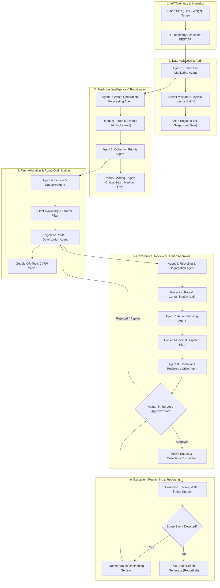

# Agentic AI Smart Waste Collection & Recycling Optimization System

[](https://fastapi.tiangolo.com)
[](https://langchain-ai.github.io/langgraph/)
[](https://developers.google.com/optimization)
[](https://react.dev)
[](https://www.typescriptlang.org)
[](https://tailwindcss.com)
[](LICENSE)

An autonomous municipal decision-support and dispatch platform that orchestrates **8 specialized AI agents** inside a stateful LangGraph pipeline. The system fuses real-time IoT smart bin sensor telemetry, machine learning waste-accumulation forecasting, Google OR-Tools Capacitated Vehicle Routing Problem (CVRP) optimization, and Human-in-the-Loop operational governance.

---

## 🚀 Live Application Links

| Component | Platform | Status | URL |
| :--- | :--- | :--- | :--- |
| **Frontend Application** | **Vercel** |  | [https://frontend-five-lime-80.vercel.app](https://frontend-five-lime-80.vercel.app) |
| **Backend REST API** | **Render** |  | [https://smartwaste-backend-gb09.onrender.com](https://smartwaste-backend-gb09.onrender.com) |
| **Interactive API Docs** | **Swagger UI** |  | [https://smartwaste-backend-gb09.onrender.com/docs](https://smartwaste-backend-gb09.onrender.com/docs) |
| **GitHub Repository** | **GitHub** |  | [mragapranathi/Agentic-AI-Smart-Waste-Collection-Recycling-Optimization-System](https://github.com/mragapranathi/Agentic-AI-Smart-Waste-Collection-Recycling-Optimization-System) |

---

## 🏛️ System Architecture



---

## 🤖 Multi-Agent Ensemble Specification

The system organizes **8 specialized autonomous agents** orchestrated via **LangGraph**:

| Agent # | Name | Primary Role | Output & Governance |
| :---: | :--- | :--- | :--- |
| **1** | **Smart Bin Monitoring Agent** | Telemetry ingestion, sensor drift detection, and physical consistency validation. | Validated bin states, sensor health, and operational alerts. |
| **2** | **Waste Generation Forecasting Agent** | Evaluates historical fill growth and projects 24h accumulation trajectories using Random Forest. | Predicted fill levels and threshold-crossing hours. |
| **3** | **Collection Priority Agent** | Computes deterministic priority scores (0–100) based on fill, forecast, and waste hazard. | Categorization: CRITICAL, HIGH, MEDIUM, LOW, SENSOR_VERIFICATION_REQUIRED. |
| **4** | **Vehicle & Capacity Agent** | Audits fleet availability, volumetric reserve capacities, and waste-stream compatibility. | Qualified vehicle fleet filtered by waste stream. |
| **5** | **Route Optimization Agent** | Solves Capacitated Vehicle Routing Problem (CVRP) using Google OR-Tools. | Optimized routes minimizing travel distance and fuel consumption. |
| **6** | **Recycling & Segregation Agent** | Audits cross-stream contamination and tracks zone-level recycling rates. | Segregation compliance scorecard and contamination hotspot warnings. |
| **7** | **Waste Operations & Action Planning Agent** | Synthesizes route allocations, driver shifts, and ETAs into a unified dispatch plan. | Formal municipal dispatch proposal submitted to governance queue. |
| **8** | **Operations Reviewer / Critic Agent** | Independent auditor validating feasibility, safety margins, and route violations. | `APPROVED_FOR_HUMAN_REVIEW` or `REQUIRES_REPLAN`. |

---

## 📊 Machine Learning Forecasting Model

The forecasting engine uses a **RandomForestRegressor** (100 estimators, max depth 12) trained on municipal sensor history to predict fill percentage 24 hours into the future.

### Feature Matrix
* `current_fill_percent`: Current bin fill percentage.
* `prev_fill_percent`: Previous sensor reading.
* `fill_change`: First-order delta between consecutive readings.
* `hour_of_day`: Diurnal consumption cycle ($0 - 23$).
* `day_of_week`: Weekly traffic variation ($0 = \text{Monday}, 6 = \text{Sunday}$).
* `waste_type`: Categorical encoding (General, Organic, Recyclable).
* `capacity_liters`: Total bin volume.
* `time_since_collection_hours`: Time elapsed since last physical servicing.
* `historical_growth_rate`: Empirical accumulation velocity (%/day).

### Benchmark Comparison

| Model | MAE | RMSE | MAPE |
| :--- | :---: | :---: | :---: |
| **Linear Regression (Baseline)** | 4.82% | 6.15% | 8.94% |
| **Random Forest Regressor (Production)** | **1.64%** | **2.10%** | **3.17%** |

---

## 🧪 Comprehensive Test Suite (TC-01 through TC-08)

All 8 scenarios are programmatically tested and verified in [`backend/tests/test_tcs.py`](file:///E:/BrightConeAI/backend/tests/test_tcs.py):

| Test Case | Scenario | Expected Behavior | Actual Behavior | Status |
| :---: | :--- | :--- | :--- | :---: |
| **TC-01** | Bin reaches 92% fill level | Categorized as HIGH or CRITICAL priority ($\text{score} \ge 65$). | Score: 69.0, Level: HIGH. Reason: *"Exceeds collection threshold (85.0%) at 92.0%."* | **PASS** ✅ |
| **TC-02** | Bin at 70%, predicted to overflow in 14h | Classified as predictive candidate, elevated to HIGH priority. | `is_predictive_candidate: True`, Level: HIGH, $+25$ points awarded. | **PASS** ✅ |
| **TC-03** | Sensor jumps from 40% to 99% in 1 min | Sensor marked SUSPICIOUS, priority set to SENSOR_VERIFICATION_REQUIRED. | Validation: SUSPICIOUS, Level: SENSOR_VERIFICATION_REQUIRED, alert raised. | **PASS** ✅ |
| **TC-04** | Multiple high-priority bins exist | Google OR-Tools generates multi-vehicle routes minimizing distance. | 3 optimized routes generated, 0 bins unassigned, capacity limits respected. | **PASS** ✅ |
| **TC-05** | Bin volume exceeds vehicle capacity | Vehicle capacity overflow prevented; unassigned bins flagged. | `RouteValidator` catches violation; invalid vehicle assignment blocked. | **PASS** ✅ |
| **TC-06** | Incompatible waste stream assigned | Assignment rejected (e.g. Organic waste into General-only truck). | `incompatible_waste` error raised; vehicle-stream segregation enforced. | **PASS** ✅ |
| **TC-07** | Critical surge bin appears during active route | Dynamic replanning triggered; stops inserted; human approval requested. | Replan plan generated (`replan_type: SURGE_STOP_INSERTION`), stops reordered. | **PASS** ✅ |
| **TC-08** | Physical collection completed | Bin fill reset to 0%, vehicle load increased, route stop marked collected. | Bin fill: 0.0%, Vehicle load: $+450\text{L}$, Collection status: COMPLETED. | **PASS** ✅ |

---

## 💻 Local Development Setup

### 1. Backend Setup
```bash
git clone https://github.com/mragapranathi/Agentic-AI-Smart-Waste-Collection-Recycling-Optimization-System.git
cd Agentic-AI-Smart-Waste-Collection-Recycling-Optimization-System

# Create virtual environment
python -m venv venv
.\venv\Scripts\activate      # Windows
source venv/bin/activate     # Mac/Linux

# Install dependencies
pip install -r requirements.txt

# Seed initial database
python scripts/seed_database.py

# Run tests
$env:PYTHONPATH="."
pytest backend/tests/test_tcs.py -v

# Start development server
uvicorn backend.app.main:app --host 0.0.0.0 --port 8000 --reload
```

### 2. Frontend Setup
```bash
cd frontend
npm install

# Start Vite dev server
npm run dev
```

---

## 📑 Detailed Documentation & Specifications

For comprehensive documentation covering agent prompts, mathematical formulation of OR-Tools CVRP, IoT sensor simulation protocols, and full schema references, refer to:
* **[Complete System Documentation (DOCUMENTATION.md)](DOCUMENTATION.md)**

---

## 📄 License
This project is open-source under the MIT License.
